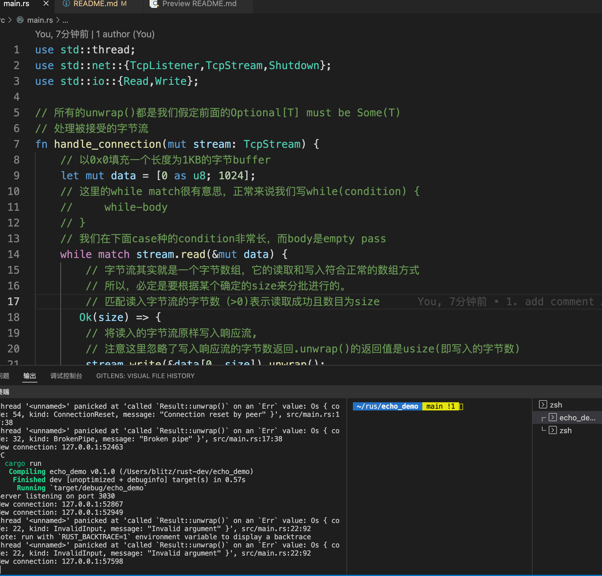
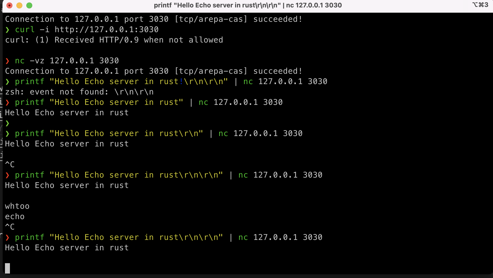

# 如何写一个简单echo服务

## 运行截图

## 前置知识
1. [socket](https://en.wikipedia.org/wiki/Network_socket)
2. [tcp](https://en.wikipedia.org/wiki/Transmission_Control_Protocol)
3. [字节流](https://en.wikipedia.org/wiki/Bitstream)
4. `read`-`write`
5. [阻塞I/O](https://medium.com/coderscorner/tale-of-client-server-and-socket-a6ef54a74763)
6. [线程](https://en.wikipedia.org/wiki/Thread_(computing))

## 需要使用的类库

* std::thread
* std::net::{TcpListener,TcpStream,Shutdown}
* std::io::{Read,Write}
